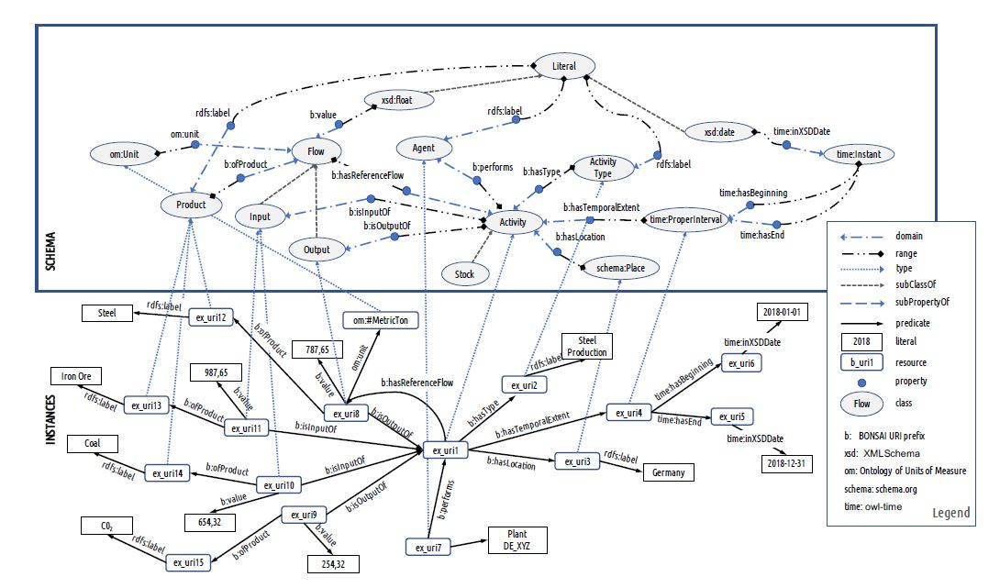

# BONSAI RDF schema
An ontology is under development. 

***
This is the first version developed based on our group discussions in addition to building upon 
previous work on minimal ontology developed by [Janowicz et al. 2015](https://pdfs.semanticscholar.org/5379/288032a5aeab5e198c00c4cdb55cb7c28cfb.pdf?_ga=2.32628088.756740515.1552645872-2134255104.1551703401)
The schema developed by this study is given below 

